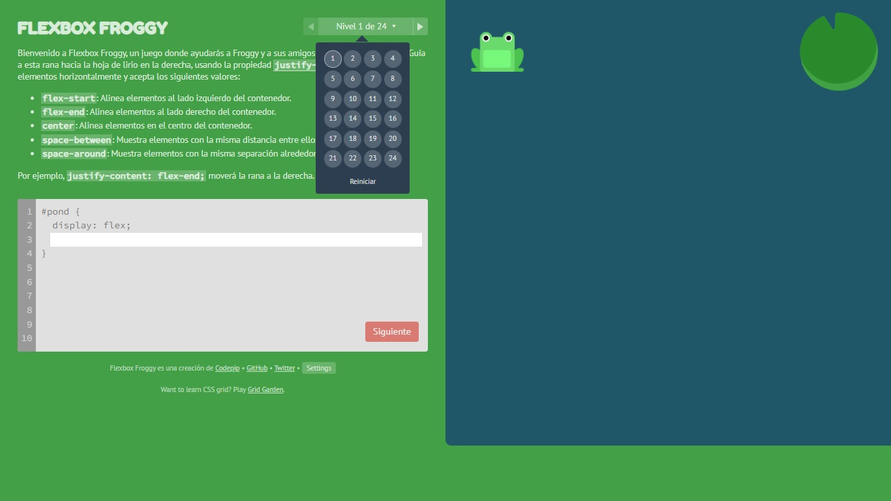

<h1 align="center">Solución del ejercicio de Flexbox Froggy</h1>

<a href="https://cristian0813.github.io/Solucion-De-Flexbox-Froggy/">

<h3> En HTML, se usa los siguientes elemento como: </h3>

Style Font de Google

Div

H1 como titulo

Button

Style images

Script para js

<h3> En CSS, se usa los siguientes elemento como:</h3>

los elemento contenedores

Elementos hover con box-shadow y transform

<h3> En JS, se usa los siguientes elemento como:</h3>

Variables LET con getElementById

Variable onclick al presionar cada boton cambie de imagen

<h2>Lenguajes de programacion usados</h2>

